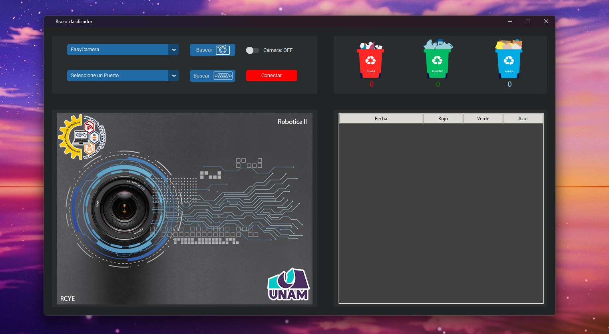

# Sistema de vision para un brazo robótico
Una interfaz de control desarrollada utilizando *Tkinter* y *[customTkinter][3]* para controlar un brazo robótico clasificador de objetos por colores con Arduino.

| _`Index.py` Interfaz de control del brazo_

# Librería de listado de cámaras
**OpenCV** No tiene una API para para enumerar las cámaras, pero gracias al aporte de [yushulx][0] con su proyecto [python-capture-device-list][1] seguimos los pasos para poder listar las cámaras para nuestro proyecto. 

## Environment   
* [Microsoft C++ Build Tools][2]
* Python 3.6 o superior
* requirements.txt

[0]:https://github.com/yushulx
[1]:https://github.com/yushulx/python-capture-device-list
[2]:https://visualstudio.microsoft.com/es/downloads/
[3]:https://github.com/TomSchimansky/CustomTkinter